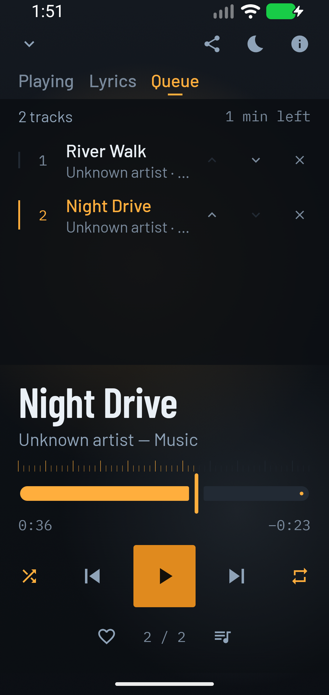
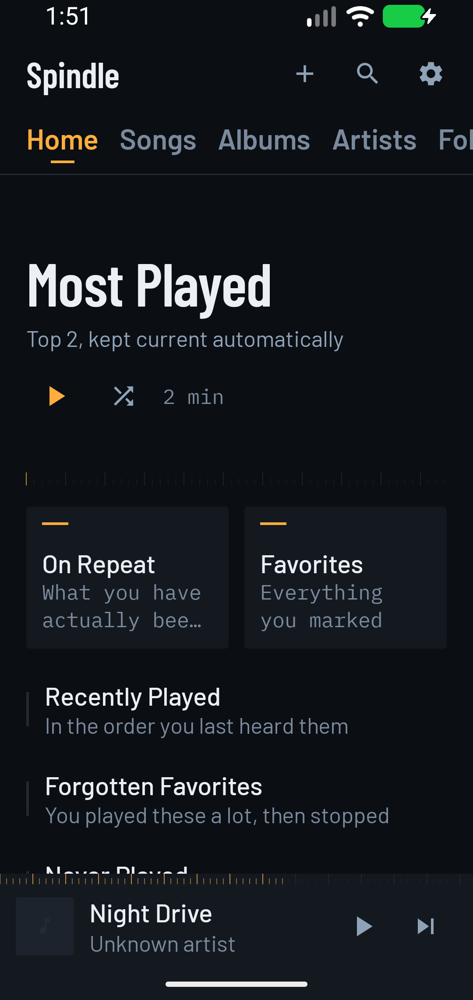
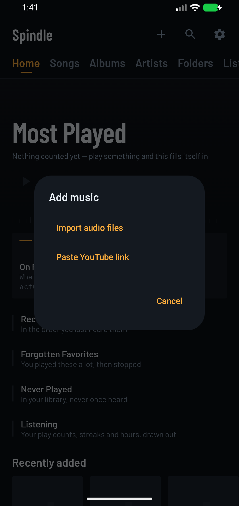

# Player reliability review — September 19, 2026

This bounded repair preserves Spindle's graphite, amber, typography, and native Android interface. The task is to find, play, arrange, and recover local music reliably.

## Changes

- Version 2 backups identify tracks by original source metadata, so title/artist corrections survive an export and restore onto changed MediaStore IDs. Version 1 remains readable; backups that already lost the original identity cannot always be matched safely. Restored playlist names remain unique.
- Queue rows preserve missing-library entries and their actual player indices. Commands reject stale revisions and distinguish repeated songs. Explicit one-song queues stay single; Android Auto browse selections carry their album/folder context.
- Saved playback includes per-track metadata, URIs, shuffle traversal, repeat mode, and position. Restoration rechecks for a newer user queue after the disk read. Widget upcoming tracks use the saved traversal.
- Replaced lyric requests cannot overwrite the active song. Scans retain the last usable library on failure, expose an error, and allow retry. Canceled or failed imports clean up their pending destination.
- Add music opens a focused choice of local files or a YouTube link. Permission denial provides app-settings recovery and checks access again on return. Network copy describes optional lyric metadata requests accurately.
- Queue move/remove controls occupy 48 dp. Queue text and icons have stronger contrast, and a graphite scrim prevents artwork glow from washing out the queue. System bars use light icons for the app's dark surface. Previous restarts the current track according to Media3's standard previous behavior.

## Automated verification

JDK 17, Gradle 8.11.1, Android debug variant:

```text
assembleDebug testDebugUnitTest lintDebug
176 tests; 0 failures, 0 errors, 0 skipped
Android lint: 0 errors, 73 warnings
```

The 17 added regression tests exercise edited backup restoration with real in-memory Room, scan failure/cancellation/retry, explicit and contextual selections, missing and repeated queue entries, stale commands, delayed lyrics, partial import failures, and saved shuffle/repeat/metadata restoration. The previous suite had 159 passing tests. Existing lint warnings remain, primarily dependency updates; this is not a warning-free claim.

## Rendered and interaction verification

An isolated API 37 emulator used three synthetic 60-second WAV files. No personal library was used. Phone views were reviewed at 1080 × 2280, including 360 dp width and font scale 1.3.

- Denied audio access, observed recovery copy, opened this app's Android settings, granted test permission while backgrounded, and returned to a populated library.
- Opened Add music and its YouTube link dialog; checked the empty-link disabled action.
- Played a three-song queue. Moved River Walk from third to second, then removed Morning Light; the remaining queue was River Walk and Night Drive.
- Enabled shuffle and repeat-all, paused Night Drive at 0:36, force-stopped only the test app, and reopened it. The two-song queue, current song, paused position, shuffle, and repeat-all were restored.
- Disabled Android animation scales and exercised queue actions. Keyboard Tab produced visible focus on the collapse control. Full screen-reader and keyboard traversal were not audited.
- Inspected the compact player and queue with larger text. Text and controls remained within the view; long secondary labels truncate deliberately.

Contrast correction was based on rendered pixels: Steel.Dim over the original amber glow measured as low as 2.80:1 in sampled queue backgrounds. The queue now uses the existing 90% graphite scrim; Steel.Dim against Ground.Deep is 5.47:1. Final screenshot samples measured 5.31–5.40:1 for Steel.Dim over queue backgrounds. Light status-bar icons were verified in the corrected build.

## Limits and follow-up

- This is a native Android app; a desktop browser layout does not apply. Physical-device audio quality, Bluetooth, Android Auto head-unit behavior, launcher widget rendering, real provider downloads, and screen-reader traversal were not verified end to end. Their changed core logic is covered where described above.
- The first 1.5 GB emulator run suffered systemwide memory/I/O pressure and ANR dialogs. A clean 4 GB restart completed the interaction checks. This does not establish physical-device performance.
- The canonical `~/.Codex/DESIGN_SYSTEM.md` and global dialect-lint script were unavailable. The existing project palette and theme served as the identity reference. No new identity was introduced. The available design scanner passed the bounded sources but is CSS-oriented and cannot certify native accessibility. A targeted American English scan was used instead of the missing dialect tool.

Do not treat this record as release-device certification. Build and automated checks pass; device-specific integration checks remain before a production release.

## Screenshots

Final compact queue at 360 dp and 1.3 font scale:



Final library:



Add music task flow (captured before the final system-bar correction):


